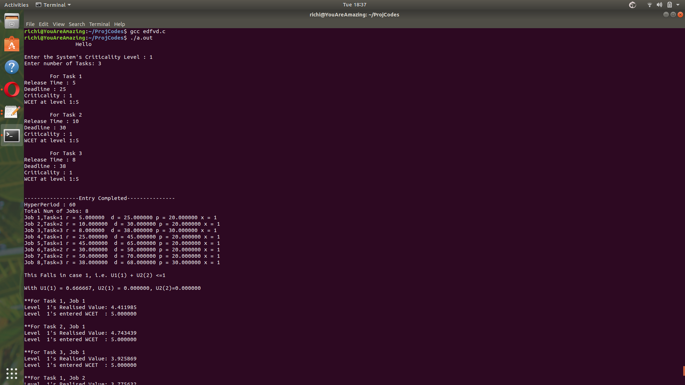
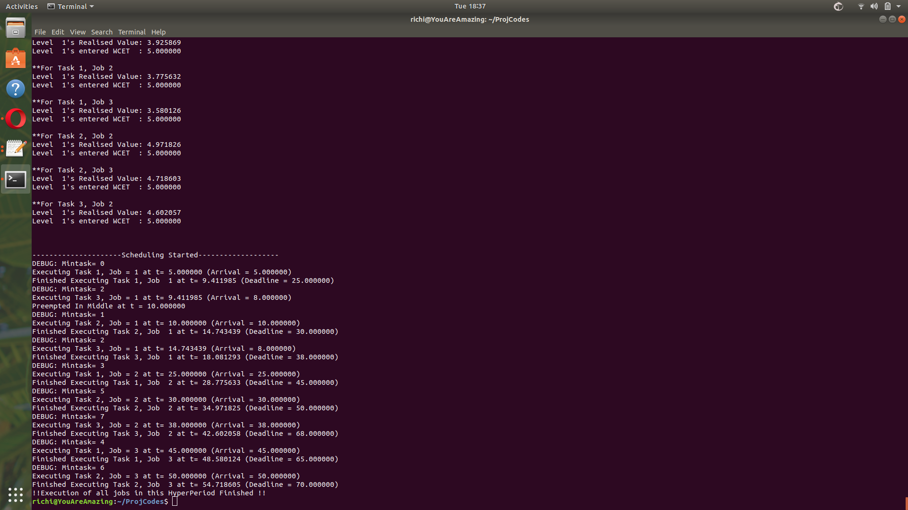

# EDF-VD-in-C
This code would execute the EDF VD Scheduling Algorithm for mixed criticality systems as described in the paper "ed-Criticality Scheduling of Sporadic Task Systems " by Sanjoy Baruah, Vincenzo Bonifaci, Gianlorenzo d’Angelo, Alberto Marchetti-Spaccamela, Suzanne Ster, Leen Stougi

Current Look :

